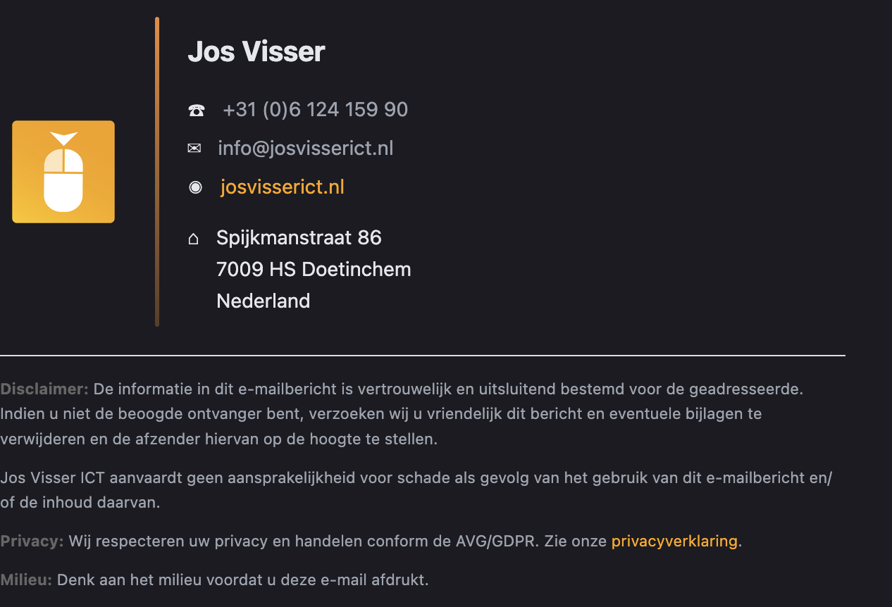

# Email Signature & Brand Kit - Jos Visser ICT

Professional email signature with Brand Kit asset hosting, powered by Cloudflare Pages.



## ✅ Status: Fully Operational

Complete brand asset system with email signature, logo variants, and legal pages!

---

## ✨ Features

### Email Signature
- 🎨 **Clean, modern design** - Professional layout without icon clutter
- 🌓 **Dark mode support** - Text colors adapt automatically
- 📱 **Mobile-optimized** - 90×90px logo, perfect for all devices
- 🟠 **Orange branding** - Gradient separator (#ea8b39)
- 📧 **Universal compatibility** - Gmail, Outlook, Apple Mail, iOS

### Brand Kit
- 🎨 **Modern dark theme** - Asset hosting pagina geïnspireerd op industry best practices
- 🖼️ **Multiple logo variants** - Full Colour, Black, App Icon, Favicon, Artboard
- 📋 **One-click copy** - Copy buttons bij elke URL
- 🔗 **Direct preview** - Klikbare URLs openen in nieuwe tab
- ⚡ **Real-time updates** - Live status monitoring
- 🌐 **Favicon support** - Brand consistency across alle pagina's

### Legal & Privacy
- 🔒 **GDPR compliant** - Volledige privacyverklaring (AVG)
- 📜 **Algemene Voorwaarden** - Terms of Use pagina
- 🍪 **Cookie compliance** - Optionele consent banner beschikbaar
- 🌐 **Global CDN** - Fast loading via `static.josvisserict.nl`

---

## 🚀 Quick Start

### Email Signature Installation

**Method 1: Via Brand Kit Page (Recommended)**
1. Visit: `https://static.josvisserict.nl`
2. Scroll to "Email Signature" section
3. Click "📋 Kopieer Handtekening"
4. Paste in email client → Done! ✅

**Method 2: Via Local File**
1. Open `signature-final-preview.html` in browser
2. Select from gray box → Cmd+A → Cmd+C
3. Install in Mail: Settings → Signatures → Paste
4. Done! ✅

### Brand Assets Access

Visit the Brand Kit: `https://static.josvisserict.nl`
- View all logo variants
- Copy asset URLs with one click
- Preview email signature
- Access legal pages

---

## 📁 Main Files

| File | Purpose |
|------|---------|
| **`signature-final.html`** | Email signature HTML ⭐ |
| **`signature-final-preview.html`** | Local preview page |
| **`cloudflare-pages/index.html`** | Brand Kit hosting pagina |
| **`cloudflare-pages/privacy.html`** | Privacyverklaring (GDPR) |
| **`cloudflare-pages/terms.html`** | Algemene Voorwaarden |

---

## 📚 Documentation

**All guides in the [Wiki →](https://github.com/Qballjos/Email_Signature_JosVisserICT/wiki)**

| Guide | Description |
|-------|-------------|
| [Quick Start](https://github.com/Qballjos/Email_Signature_JosVisserICT/wiki/Quick-Start-Guide) | Get started fast |
| [Installation](https://github.com/Qballjos/Email_Signature_JosVisserICT/wiki/Installation-Guide) | Detailed setup |
| [iOS Compatibility](https://github.com/Qballjos/Email_Signature_JosVisserICT/wiki/iOS-Compatibility) | iPhone & iPad guide |
| [Troubleshooting](https://github.com/Qballjos/Email_Signature_JosVisserICT/wiki/Troubleshooting) | Common issues |

---

## 🎨 Design Specifications

### Logo Variants
| Variant | Bestand | Gebruik |
|---------|---------|---------|
| **Full Colour** | `josvisser-logo-full-colour.png` | Primair gebruik |
| **Black** | `josvisser-logo-black.png` | Lichte achtergronden |
| **App Icon** | `josvisser-logo-app-icon.png` | Application icons |
| **Favicon** | `josvisser-logo-favicon.png` | Website favicon |
| **Artboard** | `josvisser-logo-artboard.png` | Design artboard |
| **Legacy** | `josvisser-logo.png` | Email signature (1360×1360px) |

### Email Signature Specs
- **Logo size:** 90×90px (displayed), 1360×1360px (source)
- **Style:** Rounded corners (12px radius)
- **Separator:** 3px × 220px, gradient orange
- **Font:** System fonts (-apple-system, Segoe UI, Roboto)
- **No icons:** Unicode icons removed for better alignment

### Color Palette
- **Primary Orange:** `#ea8b39`
- **Accent Orange:** `#ffa500`
- **Gradient:** `#ea8b39` → `rgba(234, 139, 57, 0.3)`
- **Dark Background:** `#0f0f0f` (Brand Kit)
- **Text Dark:** `#1a1a1a`
- **Text Medium:** `#666666`
- **Text Light:** `#999999`

---

## 📁 Project Structure

```
Email_Signature_JosVisserICT/
│
├── 📧 SIGNATURE FILES
│   ├── signature-final.html                  ⭐ EMAIL SIGNATURE
│   └── signature-final-preview.html          Local preview page
│
├── ☁️ CLOUDFLARE PAGES (static.josvisserict.nl)
│   └── cloudflare-pages/
│       ├── assets/                           Logo variants
│       │   ├── josvisser-logo-full-colour.png   ⭐ Primary
│       │   ├── josvisser-logo-black.png         Light backgrounds
│       │   ├── josvisser-logo-app-icon.png      App icons
│       │   ├── josvisser-logo-favicon.png       Favicon
│       │   ├── josvisser-logo-artboard.png      Artboard
│       │   ├── josvisser-logo.png               Email signature
│       │   └── app.png                          Original
│       ├── index.html                        ⭐ Brand Kit pagina
│       ├── privacy.html                      Privacyverklaring (GDPR)
│       ├── terms.html                        Algemene Voorwaarden
│       ├── cookie-consent.js                 Optional cookie banner
│       ├── wrangler.toml                     Cloudflare config
│       └── _headers                          CORS headers
│
├── 📚 DOCUMENTATION
│   ├── README.md                             This file
│   └── wiki/                                 Complete documentation
│
└── 📜 EXTRAS
    ├── disclaimers/                          Standalone disclaimers
    └── assets/screenshot.png                 Preview image
```

---

## 🌐 Live URLs

| Resource | URL | Status |
|----------|-----|--------|
| **Brand Kit** | https://static.josvisserict.nl | ✅ Live |
| **Email Logo** | https://static.josvisserict.nl/assets/josvisser-logo.png | ✅ Live |
| **Full Colour Logo** | https://static.josvisserict.nl/assets/josvisser-logo-full-colour.png | ✅ Live |
| **Black Logo** | https://static.josvisserict.nl/assets/josvisser-logo-black.png | ✅ Live |
| **Privacy** | https://static.josvisserict.nl/privacy.html | ✅ Live |
| **Terms** | https://static.josvisserict.nl/terms.html | ✅ Live |
| **Repository** | https://github.com/Qballjos/Email_Signature_JosVisserICT | ✅ Public |

---

## 🛠️ Technology Stack

- **HTML/CSS** - Email-safe table layouts with inline styles
- **JavaScript** - Copy-to-clipboard functionality
- **Cloudflare Pages** - Global CDN & asset hosting
- **Custom Domain** - `static.josvisserict.nl`
- **Git** - Version control via GitHub
- **Auto-deployment** - Push to main → instant deploy

---

## 🔒 GDPR Compliance

✅ **Privacy Policy** - Volledige AVG/GDPR compliant privacyverklaring  
✅ **Terms of Use** - Nederlandse algemene voorwaarden  
✅ **No tracking** - Geen analytics of marketing cookies  
✅ **Secure** - HTTPS met Cloudflare SSL  
✅ **Transparent** - Duidelijke informatie over gegevensverwerking

---

## 🚀 Deployment

**Automatic via Cloudflare Pages:**
1. Push to `main` branch
2. Cloudflare auto-deploys binnen 1-2 minuten
3. Live op `static.josvisserict.nl`
4. Global CDN caching voor snelle laadtijden

**Local testing:**
```bash
# View files locally
open signature-final-preview.html
open cloudflare-pages/index.html
```

**Deployment Tips:**
- ✅ Gebruik URL-vriendelijke bestandsnamen (geen spaties)
- ✅ Test locale bestanden voor push
- ✅ Check Cloudflare dashboard voor deployment status
- ✅ Clear browser cache als wijzigingen niet zichtbaar zijn

---

## 📄 License

MIT License - See [LICENSE](LICENSE) file.

Copyright © 2025 Jos Visser

---

## 🎉 Complete Brand Asset System

Professional email signature + Brand Kit hosting + Legal pages = Complete solution!

**Quick Links:**
- 🎨 [Brand Kit](https://static.josvisserict.nl) - Asset overview met copy functionaliteit
- 🔒 [Privacy](https://static.josvisserict.nl/privacy.html) - AVG/GDPR compliant
- 📜 [Terms](https://static.josvisserict.nl/terms.html) - Algemene Voorwaarden
- 📚 [Documentation Wiki](https://github.com/Qballjos/Email_Signature_JosVisserICT/wiki) - Complete docs

**Features Overzicht:**
- ✅ 6 logo varianten (URL-vriendelijke bestandsnamen)
- ✅ Email signature copy functionaliteit
- ✅ Favicon op alle pagina's
- ✅ Apple Touch Icon support
- ✅ Privacy & Terms pages
- ✅ GDPR compliant (geen tracking)
- ✅ Cloudflare CDN hosting
- ✅ Auto-deployment via GitHub
- ✅ Mobile-responsive design
